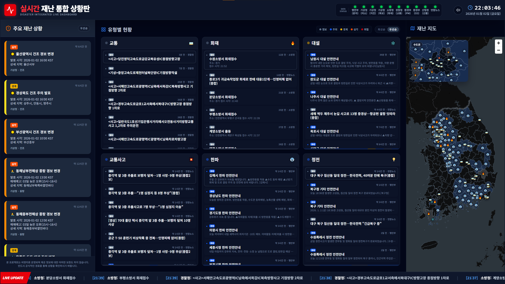

# disaster-feed-web



[Backend 저장소 참고](https://github.com/neuwcodebox/disaster-feed)

## 행정구역 경계 데이터 출처

본 서비스의 2026년 행정구역 경계 데이터는 통계청 통계지리정보서비스(SGIS)가
[공공누리 제1유형](https://www.kogl.or.kr/info/licenseType1.do)으로 개방한 행정동 경계를
[vuski/admdongkor](https://github.com/vuski/admdongkor)가 가공한 자료입니다.
가공물은 [CC BY 4.0](https://creativecommons.org/licenses/by/4.0/)으로 배포되며,
자세한 조건은 원본 저장소의 [LICENSE-DATA](https://github.com/vuski/admdongkor/blob/master/LICENSE-DATA)를 따릅니다.

`public/regions/SIG-20260701.json`은 다음 명령으로 행정동 원본을 시·군·구 단위로 사전 병합하고
경량화하여 생성합니다.

```sh
npm run regions:build -- /path/to/HangJeongDong_ver20260701.geojson
```
